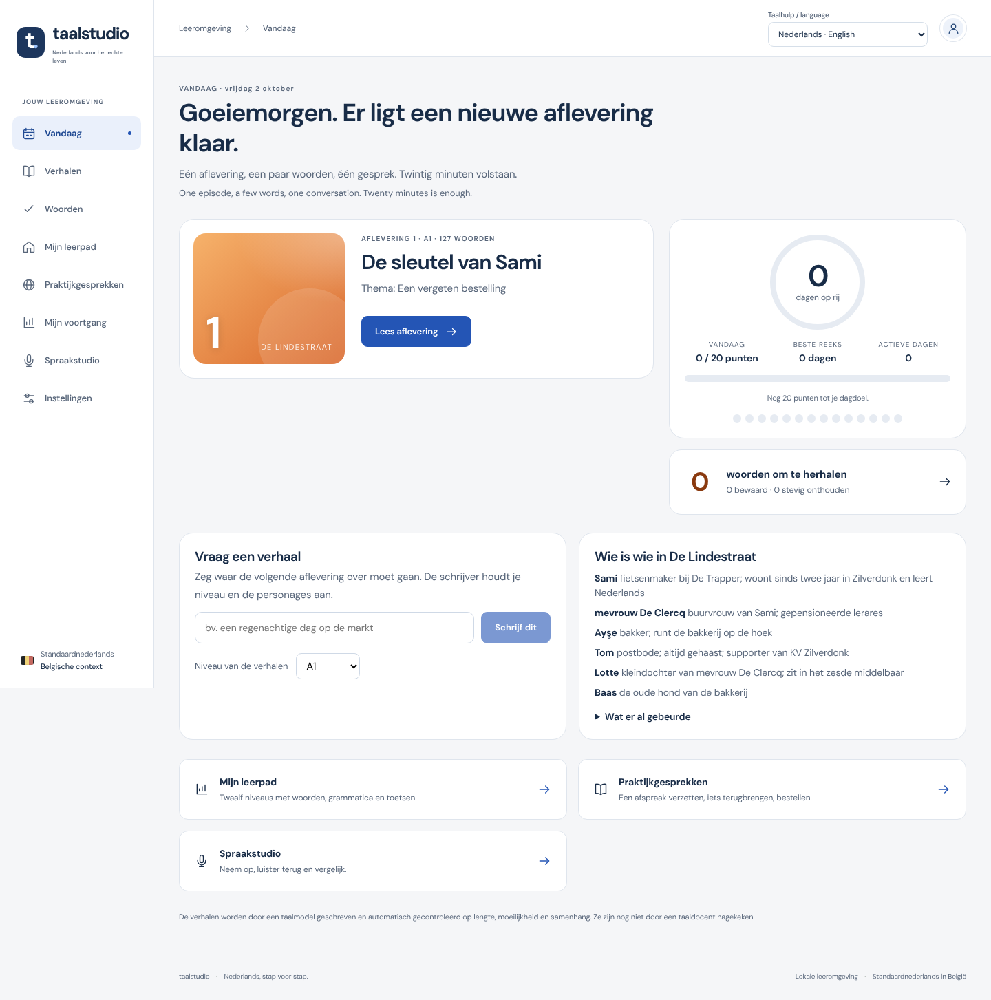

# Taalstudio — Belgian Dutch, one episode a day

A personal learning environment for Belgian Standard Dutch. Each day it offers one new episode of a
continuing story written at your level, a handful of saved words that are due for review, and one
conversation to practise — with the twelve-stage course, topic practice and role-play missions behind it.



## What it does

**Vandaag** (`/`) — the daily plan: your streak, today's points against a goal of twenty, the episode that
is ready, the words that are due, and one obvious next step.

**De Lindestraat** (`/verhalen`) — a serial about a street in an invented Flemish town. Episodes are
written by the configured chat model from a fixed cast, your level and the words you have saved, then
checked by code before you see them: Dutch, length and sentence complexity per level, vocabulary
coverage, comprehension questions that are provably answerable from the text, Belgian forms. Each episode
ends with a choice that shapes the next one. You can read along with synthetic audio, read a paragraph
aloud and see which words were recognised, ask for a Persian translation of any paragraph, save any new
word, answer three questions and rate the episode. See [the story engine](docs/STORY_ENGINE.md).

**Woorden** (`/woorden`) — your word bank. Words you save from stories (or add yourself) come back for
review with spaced repetition; a word you forget returns ten minutes later, a word you know returns in
days, then weeks.

**Mijn leerpad** (`/leerpad`) — the structured course: pre-A1 → A1 → pre-A2 → A2 → pre-B1 → B1 → pre-B2
→ B2 → pre-C1 → C1 → pre-C2 → C2, each stage with vocabulary cards, grammar drills, a story, listening,
speaking and writing tasks, 100 practice situations per skill and a four-skill final check. Every stage is
open; passing a check is recorded per skill and never pretends to be a CEFR certificate.

**Praktijkgesprekken** (`/missions`) — role-play with a character whose calendar is enforced by code:
rescheduling an appointment, ordering lunch, returning a purchase, writing to a course. Push-to-talk
speaking, typed fallback (labelled as typed), feedback that must cite your own words.

Support languages are English and Persian (shown under the Dutch, switchable in the header); Dutch
stays the practice language. The interface is in Dutch.

**Honesty rules built in.** No pronunciation scores, no aggregate level, no certificate. Everything the
model writes is labelled as generated; all fixed Dutch is labelled as unreviewed until a Belgian Dutch
reviewer has checked it. Usage counters cap model and speech calls per day and in total.

## Architecture

| Part | Technology | Where |
|---|---|---|
| Web app (only public entry) | Next.js / React / TypeScript | `apps/web` |
| API (never public; reached through the web proxy with a signed assertion) | FastAPI / Pydantic / SQLAlchemy / Alembic | `apps/api` |
| Database | PostgreSQL 16 | Docker Compose locally; Flexible Server in Azure |
| Blob storage | Azurite locally; Azure Blob Storage | `apps/api/src/dlp/providers` |
| Chat model | Ollama locally (`llama3.1:8b` by default); Azure-hosted deployments | `apps/api/src/dlp/providers` |
| Speech | faster-whisper + Piper locally; Azure Speech `nl-BE` | `apps/api/src/dlp/providers` |
| Background work | PostgreSQL job table with leases, run by an in-process loop | `apps/api/src/dlp/domains/jobs` |
| Content | 12-stage path, topic practice, word/story libraries, four missions | `content/` |
| Story engine | serial bible, stage profiles, validator, SM-2 word bank, daily points | `apps/api/src/dlp/domains/stories` |
| Infrastructure | Bicep, GitHub Actions (CI + manual OIDC deploy) | `infra/`, `.github/workflows` |

Every external service sits behind a narrow interface with a local, a fixture and an Azure
implementation; the provider is chosen in `.env`. Dates, availability, bookings, task completion, usage
limits and submissions are decided in application code — models propose, code validates.
Details: [engineering notes](docs/ENGINEERING.md), [decisions](docs/DECISIONS.md).

## Run it on a laptop

Prerequisites: Docker Desktop, [Ollama](https://ollama.com) with an instruction-tuned model pulled
(`ollama pull llama3.1:8b`), and either conda (recommended: Python, Node and ffmpeg in one environment)
or Python 3.11+, Node 22 LTS and `ffmpeg` on the PATH.

```
conda env create -f environment.yml
conda activate dlp
python scripts/run.py setup        # pip (API), npm (web), Playwright browser, creates .env from .env.example
# edit .env: DEV_OWNER_EMAIL, OWNER_ALLOWLIST, ASSERTION_SIGNING_KEY (32+ random characters), LOCAL_CHAT_MODEL
python scripts/run.py services     # PostgreSQL + Azurite (dev does this by itself when they are down)
python scripts/run.py migrate
python scripts/run.py fixture      # validates and loads content/missions/*/mission.json
python scripts/fetch_piper_voice.py
python scripts/run.py preflight    # what is configured and reachable; never prints secrets
python scripts/run.py dev          # API on 127.0.0.1:8000, web on http://localhost:3000
```

After a reboot, `python scripts/run.py dev` is the only command needed: it starts the Docker services
when the database is down, applies migrations, loads the content, starts `ollama serve` when nothing
answers at `LOCAL_CHAT_BASE_URL`, then runs the API and the web app. Open <http://localhost:3000>; the
first episode is queued on the first visit and takes one to three minutes with a local 8B model on a
laptop CPU. To watch the writer work directly:

```
cd apps/api && python -m dlp.cli write-episode --stage a1 --theme "op de markt"
```

Speech recognition uses faster-whisper `small` by default; `LOCAL_STT_MODEL=medium` is clearly better on
non-native Dutch at about three times the recognition time.

Keep comments on their own lines in `.env`: a line such as `KEY= # note` is read as the value `# note`.

### Notes for WSL 2

- Docker Desktop must have **Settings → Resources → WSL integration** switched on for the distro you
  work in; otherwise `docker` does not exist inside WSL and `services` fails.
- The task runner strips other Python installations (for example a ROS 2 `python3.10` tree) from
  `PYTHONPATH` before it starts anything, so their pytest plugins cannot break the test run.
- Before the first `e2e`, headless Chromium needs a few system libraries. Inside `apps/web` run
  `sudo env "PATH=$PATH" npx playwright install-deps chromium` once (plain `sudo npx` resets PATH
  and picks up an old system Node, which fails with a syntax error).
- `FFMPEG_MEMORY_LIMIT_MB` caps ffmpeg's virtual address space. The conda-forge ffmpeg build needs
  more than 1 GB; the default is 2048. "audio conversion failed" with "failed to map segment" in the
  API log means the cap is too small.
- In development mode the first request to a route takes 10–20 s on `/mnt/c` (Next.js compiles on
  demand); production builds do not.

## Checks

```
python scripts/run.py test         # API suite (needs the *_test database; see docs/VERIFICATION.md)
python scripts/run.py e2e          # builds the web app, starts api + web with fixture providers, runs Playwright
cd apps/web && npm run test:unit   # browser-side unit tests
python scripts/run.py benchmark    # language-benchmark plumbing dry runs
python scripts/run.py acceptance   # check A01
make lint                          # ruff, eslint, tsc
```

API and browser test databases must end in `_test`; test cleanup refuses the normal learner database.
CI runs all of this on every push to `main`.

## Going live

Nothing is deployed yet. [GO_LIVE](docs/GO_LIVE.md) is the runbook (allowance, app registration,
foundation, images, migration job, private deployment, sign-in, publication); `scripts/verify_live.py`
checks each live service and moves the Azure adapters from `integration_pending` to `verified_live`.
Paid use is switched on deliberately with `PAID_USAGE_ENABLED`, never by the presence of credentials.

## Documents

- [STATUS](docs/STATUS.md) — what works, known limits, the next steps.
- [VERIFICATION](docs/VERIFICATION.md) — what was checked, where, with which status.
- [STORY_ENGINE](docs/STORY_ENGINE.md) — how episodes are written, validated and scheduled.
- [ENGINEERING](docs/ENGINEERING.md) — architecture, conventions, trust boundaries, tests.
- [DECISIONS](docs/DECISIONS.md) — decisions with their reasons.
- [DEMO](docs/DEMO.md) — a twenty-minute walkthrough for a language reviewer.
- [CURRICULUM](docs/CURRICULUM.md), [TOPIC_PRACTICE](docs/TOPIC_PRACTICE.md), [PRACTICE_LIBRARY](docs/PRACTICE_LIBRARY.md), [SOURCE_COVERAGE](docs/SOURCE_COVERAGE.md) — the static content and what it was built from.
- [LEARNING_AGENTS](docs/LEARNING_AGENTS.md), [LEARNING_DESIGN](docs/LEARNING_DESIGN.md) — the conversation partner, the coach, the editing queue, and the learning loop behind the course.
