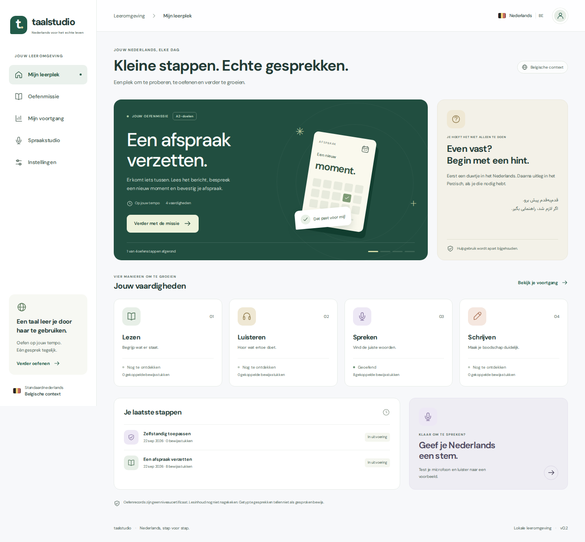
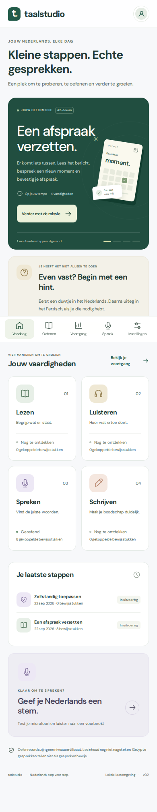

# Taalstudio interface preview

Actual Chromium renders from the automated suite, 22 September 2026. These show **test fixture data**,
not a real learner's progress and not a deployed Azure service. The desktop screenshot is 1440 px wide;
the mobile screenshot is 390 px wide with a fixed bottom navigation bar. A full-page screenshot includes
that bar at the viewport's bottom even though the page continues below it.

## Desktop

## Mobile

The same design system covers the mission workspace, progress, speech studio and settings.
The CI report includes their screenshots and automated contrast/landmark/control checks.
Browser emulation does not establish physical iOS/Android microphone behaviour.
