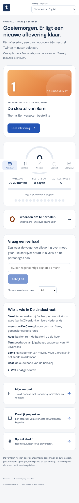
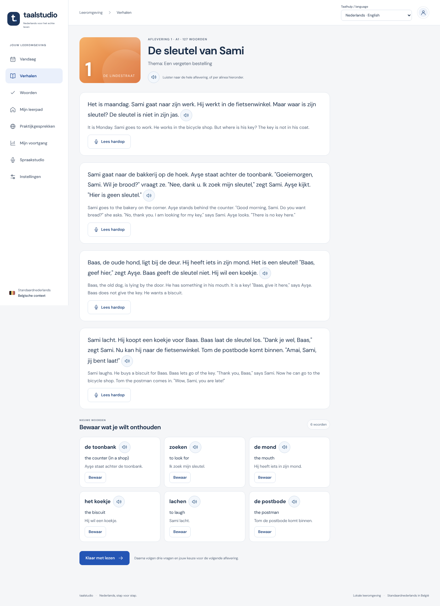
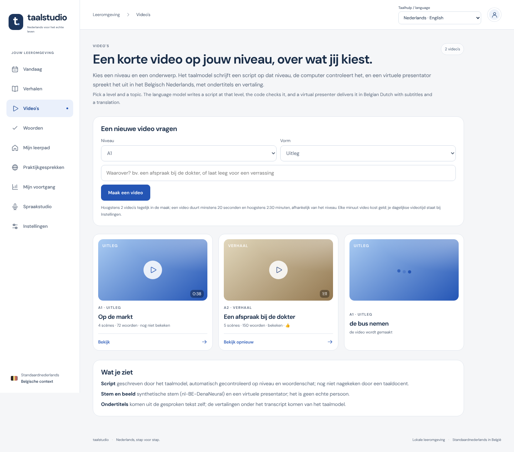
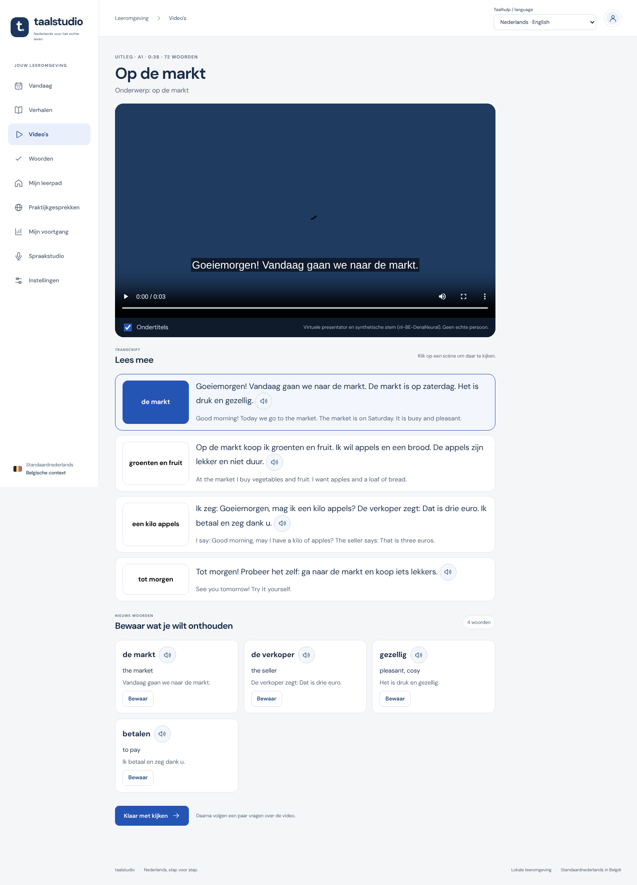
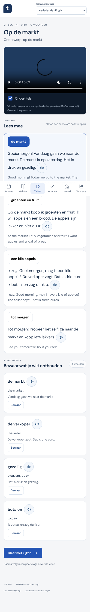

# Interface preview

Chromium renders from the automated suite, 2 October 2026, with **fixture data** (a fixture-written
episode, no real learner history, no deployed service). Desktop is 1440 px wide; the phone render is
390 px wide with the fixed bottom navigation, which a full-page screenshot shows mid-page.

## Vandaag (home)

## An episode of De Lindestraat

## Video lessons

The same design system covers the learning path, the topic practice, the missions, the word review,
the speech studio and settings. The CI report attaches screenshots of every screen at 1440, 390 and
320 px together with automated contrast, landmark and control checks. Browser emulation does not
establish physical iOS/Android microphone behaviour.
